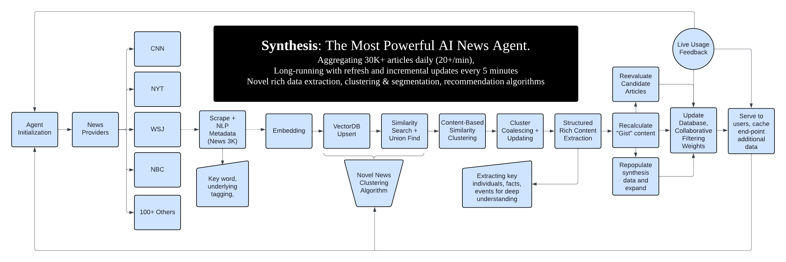

# Synthesis: The Next Generation News App Combating Misinformation and Echo Chambers in the Age of Social Media and AI.

## We built out a universal AI agent framework to constantly scrape and categorize all the newest news, building a custom feedback loop, novel clustering algorithm, and a new approach to recommendations that prevent polarization. 

We analyze over 60,000 articles (scraping an additional 20+ every single minute) and cluster algorithms using a novel topic relationship model using embedding relationships and a Union-Find structure for relationships. We then build out key features off of this foundation to change the way people interact with news with the goal of preventing spread of misinformation, falling into echo chambers or extreme polarization. Some cool key features include:

* Scale: News aggregated from 60K+ articles daily (100+ sources)
* Clustering: Novel system for grouping to increase knowledge
* Gists: At a glance overviews of topics via rich content extraction
* Syntheses: Unbiased aggregation of many similar-topic articles
* Algorithm: Recommendations regularize/balance against echo
* Info Traversal: Within-topic and global semantic search
* Hyperpersonalization: Dynamic reading level adjustment
* Extensions: Question and answering, content explanations
* Rich Extraction: High-fidelity data for visuals and tooling

Built by Christopher Arraya, Ron Nachum, & Pranav Ramesh.
